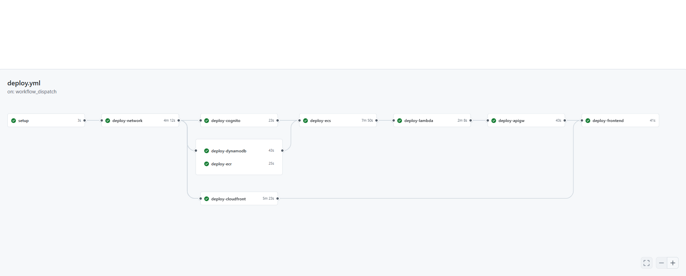

# GitHub Actions × IaC（CloudFormation）による環境構築

---

## 🎯 概要

コンソール上で手動作成した環境を
CloudFormationでIac化し、GitHub Actions による CI/CD パイプラインで dev / test / prod の 3環境
を自動で構築できるようにした。
---

## 🧱 課題

 1.手動で構築をすると、時間がかかり、ミスも増える
 2.ユニットメンバーごとに環境を展開したいときに都度、環境を作る必要がある
 3.手動構築だと、知識をメンバーに共有しにくい

## 🏗️ workflow

### 各スタックの説明

| **[スタック名]** | **[役割]** |
| --- | --- |
| **[network]** | 他のスタックが参照する VPC / SG を作成 |
| **[dynamodb]** | DynamoDBを作成。ECS（タスクロールのポリシー） が ARN を参照 |
| **[ecr]** | ECRを作成。ECS がリポジトリ名を参照 |
| **[cognito]** | Cognitoを作成。API Gateway が UserPool を参照 |
| **[ecs]** | ECS及びALBを作成。Lambda が ALB DNS を参照 |
| **[lambda]** | Lambdaを作成。API Gateway が Lambda ARN を参照 |
| **[cloudfront]** | CloudFront及びS3を作成。依存なし |
| **[apigw]** | API Gatewayを作成。cognito / lambda が必要 |

### 各スタックの実行順序

| 実行順 | スタック | 並列/直列 | 待つ相手 |
|--------|---------|----------|---------|
| 1 | network | 直列 | なし |
| 2 | dynamodb / ecr / cognito / cloudfront | **並列** | network |
| 3 | ecs | 直列 | dynamodb・ecr |
| 4 | lambda | 直列 | ecs |
| 5 | apigw | 直列 | cognito・lambda |
| 6 | frontend | 直列 | cloudfront・apigw |

### 詰まった点と解決策

#### 詰まった点⓵
手動作成時に試行錯誤しながら設定をした。
設定が煩雑化してしまっている部分もあり、後からIaC化しようとすると、「そもそもこの設定は何のために存在しているのか？」 を読み解く作業が必要になってしまった

####　解決策⓵
一つのサービスを構築したら、同時にそれをコードに書き起こすようにした。
結果、「どの設定が必要で」「なぜその値にして」「どのリソースと依存しているか」がコードとコメントにそのまま残り、構成を明確に整理することができるようになった。
---
