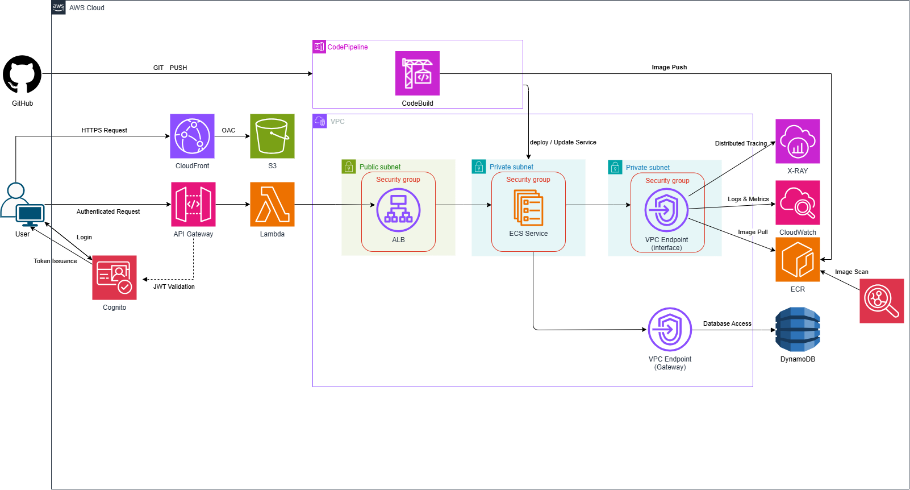

# DISP-Unit-Project

> DISP社内向けトライアル開発用AWS共通基盤

---

## 🎯 プロジェクトの背景・目的

本チームでは、新しい取り組みの検証を開始するたびにゼロからインフラを構築していました。<br>
その結果、初期工数がかさみ、検証開始までの期間が長期化していました。

本プロジェクトでは、トライアル開発を開始できる共通基盤を整備しました。<br>
これにより、アプリケーションの動作を早期に検証できる環境を提供します。

この基盤が解決する課題は2つあります。

- **新規構築コストの削減** — 本基盤が提供する共通機能により、エンジニアが一から開発する負荷を軽減します。
- **モダンなアーキテクチャの標準化** — SPA + BFF + コンテナ構成（React / Lambda / ECS）の実例を整理し、チーム内で再利用可能な設計指針として整備します。

この基盤を活用することで、アイデアが生まれてから検証を開始するまでの期間を短縮し、取り組みの試行回数そのものを増やすことが期待できます。

---

## 🏗️ 設計方針

本基盤の設計方針は3つあります。これらが、採用している技術の判断基準になっています。

### 迅速に検証できる開発サイクル

新規開発では実装を完了しても検証環境へ公開できない状況が、開発のボトルネックとなっていました。<br>
これは、アプリケーションをデプロイするための各種インフラ作業が完了するまで、公開に時間を要していたためです。

本基盤では、これらのインフラ構築を自動化しており、開発初期段階から検証環境への公開が可能です。<br>
また、フロントエンドとバックエンドの依存関係を最小限を目指しています。
これにより、UIのみを先行して公開・検証するなど、柔軟な開発サイクルを支援します。

### アプリケーション開発に集中できる実行環境

スケールや可用性の管理は、基盤側で自動的に担保されるため、開発者が意識する必要はありません。<br>
ECS Fargateによるオートスケーリングや、DynamoDBによるデータ管理の自動化により、運用負荷を最小限に抑えます。<br>
スキーマレスなデータ構造により、仕様変更に柔軟に対応できます。

### 安定してデプロイできる開発基盤

手動操作による設定ミスを防止し、開発状況をチーム全体で把握するため、CI/CDパイプラインを組み込んでいます。<br>
コード変更をトリガーとした自動ビルド・デプロイにより、常に最新のコードが環境に反映される状態を維持します。

---

## 🧱 アーキテクチャ

上記の設計方針を実現する基本アーキテクチャの構成および各要素の選定理由は以下の通りです。<br>
フロントエンドとバックエンドを分離することで、開発における柔軟性と保守性の向上を図っています。

### アーキテクチャ図


```
[ブラウザ]
    ↓ HTTPS
[CloudFront] ← S3（Reactビルド成果物）
    ↓
[Cognito] ← 認証（サインアップ・サインイン）
    ↓
[API Gateway] ← Cognito Authorizer
    ↓
[Lambda BFF] ← 振り分け・バリデーション
    ↓ HTTP
[ALB]
    ↓
[ECS Fargate（APIコンテナ）] ← Express / TypeScript
    ↓ VPCエンドポイント経由（インターネットを通らない）
[DynamoDB（UsersTable）]
```

ブラウザからのリクエストは、まずCloudFrontが受信します。<br>
Cognito認証による検証を通過した後、Lambda BFFが内容を検証し、ECSコンテナに転送します。<br>
ECSからDynamoDBへの通信はVPCエンドポイント経由のため、パブリックインターネットを経由しません。

### 構成の選択理由

| 構成要素 | トライアル開発における意図 |
|---------|--------------------------|
| S3 + CloudFront | 静的サイト配信のベストプラクティス。フロントエンドの公開・更新を迅速に実施できる |
| ECS Fargate | サーバー管理不要。コンテナイメージを更新するだけでアプリケーションをデプロイできる |
| Lambda BFF | 入口の共通化と、各チームの実装の自由度を両立できる |
| DynamoDB | スキーマレスで迅速にデータ構造を変えられる。トライアル期間中の変更に対応しやすい |
| Cognito | 認証基盤を独自に構築することなく、セキュアな認証を迅速に組み込める |
| VPCエンドポイント | インターネットを経由せずにAWSサービスと通信でき、セキュリティを向上させられる |

### セキュリティ方針

本基盤では、トライアル用途に合わせて簡潔性と安全性のバランスを取っています。<br>
外部からの通信を最小化し、内部通信にも認証を設けるという構成を採用しています。

- **外部通信の制御** — ブラウザとの通信はCloudFront経由のHTTPSに限定します。ECS↔DynamoDB間はVPCエンドポイントを利用し、パブリックインターネットを経由しない構成としています。
- **API認証** — すべてのAPIリクエストにCognitoのIDトークンが必要です。API GatewayのCognito Authorizerにより、リクエストの正当性を検証します。
- **内部通信の認証** —  Lambda↔ECS間はINTERNAL_TOKENによるトークン認証を行います。外部APIキーとは独立して管理することで、漏洩時の影響範囲を限定します。
- **最小権限の原則** — 各コンポーネントに付与するIAMロールは、動作に必要なリソースのみにアクセスを制限しています。

---

## 🛠️ 技術スタック

| 技術 | 役割 |
|------|------|
| React 18 / TypeScript | フロントエンド |
| AWS Lambda / ECS Fargate | バックエンド（BFF・APIコンテナ） |
| DynamoDB | データストア |
| Cognito | 認証基盤 |
| CloudFront | CDN配信・HTTPS化 |

詳細は [開発者ガイド](DEVELOPMENT.md) を参照してください。

---


## 💸 コストと運用効率

マネージドサービス中心の構成のため、スケールアップ・バックアップ・冗長化はAWS側の管理範囲となります。<br>
これにより、インフラ運用の工数を減らし、アプリケーション開発に注力できる環境を意図した構成にしています。

コストはすべて従量課金です。

以下の条件を前提とした場合、月額コストは数百円から数千円程度となる見込みです。

- 開発メンバー：数名規模
- 月間リクエスト数：数千〜1万件程度
- ECS Fargateタスク：開発時間帯のみ起動（夜間・休日は停止）
- DynamoDB：オンデマンドキャパシティモード、データ量が少ない期間
  
---


## 🔮 現在の位置づけと今後の方向性

### 現在の位置づけ

本基盤は、トライアル開発を迅速に開始することを目的とした最小構成としています。
そのため、本番運用を前提とした高度な要件は対象外としています。

以下の領域は現時点で対象外としています。

- **高可用性・障害復旧** — マルチリージョン構成やRTOを定めた障害復旧設計
- **高度なセキュリティ制御** — WAFによるリクエストフィルタリング、セキュリティ監査ログの長期保管
- **コスト最適化** — リザーブドインスタンスやSavings Planによる料金最適化
- **本番運用の観測性** — アラート設計・ダッシュボード・オンコール体制などの運用フロー

### 今後の方向性

以下は今後対応を予定している改善計画です。<br>
優先度に応じて順次整備を進めていきます。

優先度は以下の2軸で判断しています。
- 現時点で手動操作が残っている領域
- 利用規模拡大時にボトルネック化しやすい領域

**優先度: 高 — 現状、手動操作またはテスト空白が残っている領域**
- LambdaのCI/CDパイプライン構築 — 現在手動操作のデプロイを自動化し、フロントエンド・バックエンドと同様のフローへの統一を目指します。

**優先度: 中（スケール対応） — 利用規模が拡大したときにボトルネックが顕在化する可能性がある領域**
- ECS Workerコンテナの実装（SQSによる非同期処理） — 複数チームが同じ基盤を使い始めたときの負荷分散と、負荷の高い処理の切り離しを実現することを目的とします。
- ページネーション対応（DynamoDB ScanからQueryへの変更） — データ量が増えても安定したレスポンスを維持するために必要となります。

**優先度: 中（本番移行に向けた成熟度向上） — 本番移行を見据えた運用成熟度の向上**
- IaC（TerraformまたはCDK）によるインフラのコード化 — 現在は手動管理の部分が残存しています。インフラの再現性・レビュー可能性を高めます。
- 本番環境向けのセキュリティ強化（Internal ALB + LambdaのVPC配置） — より本番に近い構成への移行を目的とします。現在はトライアル用途のため一部をシンプルに保っています。

---

## 📚 ドキュメント

| ドキュメント | 内容 |
|------------|------|
| [開発者ガイド](docs/DEVELOPMENT.md) | 環境構築・ローカル開発・デプロイ手順 |
| [フロントエンド技術詳細](docs/frontend.md) | React・Amplify・CloudFront・CI/CDの詳細 |
| [バックエンド技術詳細](docs/backend.md) | Lambda・ECS・DynamoDB・VPC・IAMの詳細 |
| [API仕様書](docs/api-spec.md) | エンドポイント・リクエスト・エラー仕様 |
